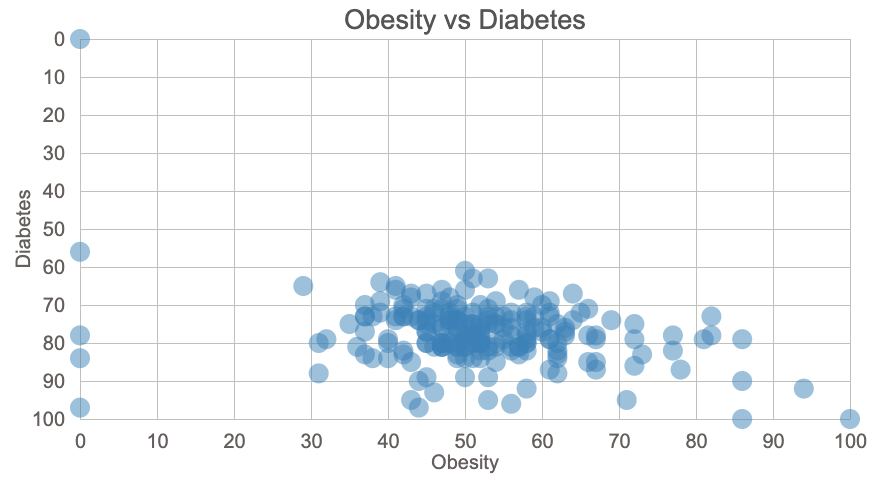

This scatter plot shows the correlation between obesity and type II diabetes.

The data comes from the year 2017 estimate in [Health searches by US Metropolitan Area: Data from Google Trends](https://www.kaggle.com/GoogleNewsLab/health-searches-us-county/data?select=RegionalInterestByConditionOverTime.csv)
